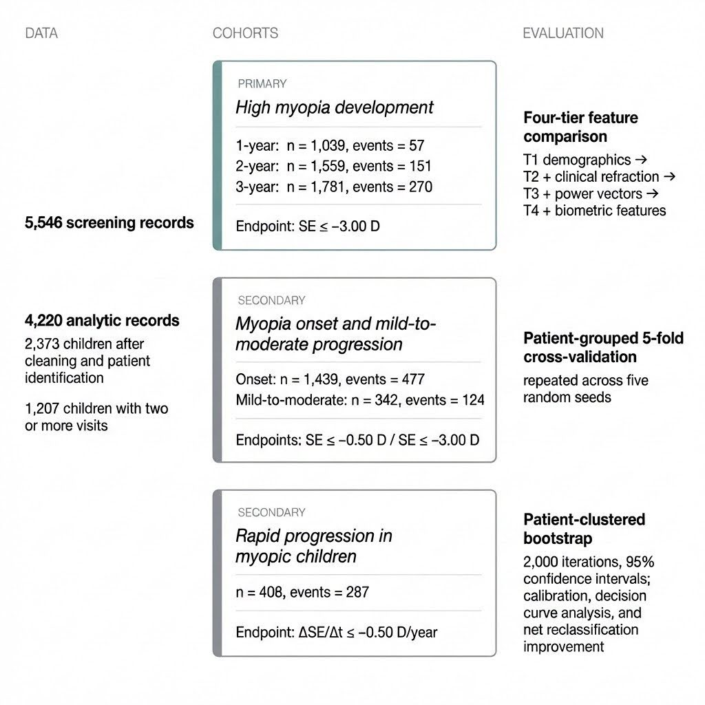
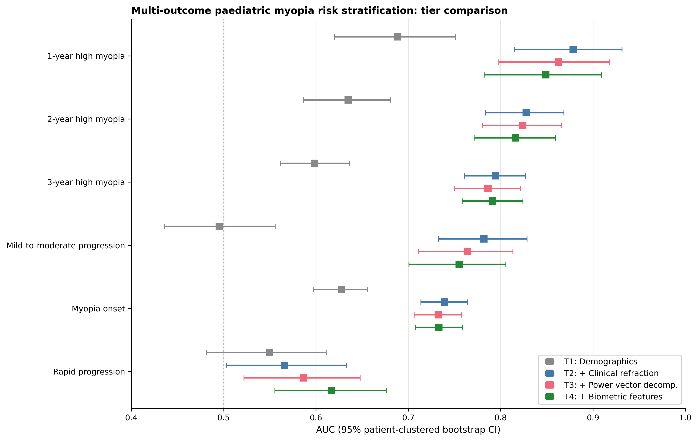

# Myopia Screening Prediction

Code and de-identified dataset for **development and internal validation of a calibrated multi-outcome risk stratification model for paediatric myopia** that predicts sight-threatening high myopia development, mild-to-moderate progression, and myopia onset over 1 to 3 year horizons using routine screening data. A parsimonious logistic regression model using age, sex, and non-cycloplegic spherical equivalent achieves AUC 0.878 (95 percent CI 0.815, 0.931) for 1-year sight-threatening high myopia prediction. The same model performs strongly on mild-to-moderate progression (AUC 0.782) and myopia onset (AUC 0.739), with discrimination preserved under a temporal split. Automated biometric features from the screening device (pupil diameter, interpupil distance, gaze deviation) do not add incremental predictive value for the state-based outcomes because they are correlated with age and refractive state.

## Overview



Four feature tiers are compared on each of six binary outcomes using patient-grouped 5-fold cross-validation, patient-clustered bootstrap (2000 iterations), DeLong tests with Holm-Bonferroni correction, and a temporal split validation (train 2018 to 2019, test 2020 to 2021). The framework additionally reports calibration after isotonic recalibration, decision curve analysis, and pre-specified sex-stratified fairness evaluation.

## Dataset

The released dataset is a de-identified export of 5,546 paediatric screening records collected at a hospital paediatric department in China between 2018 and 2021. All measurements were acquired with the SPOT Vision Screener (Welch Allyn, Skaneateles Falls, NY, USA), a handheld non-cycloplegic binocular photorefractor used in paediatric vision screening programmes.

| Field | Description |
|---|---|
| `patient_id` | Opaque keyed hash, stable across visits for the same child (used for longitudinal grouping) |
| `Gender` | M / F |
| `Screening_Year` | 2018 to 2021 |
| `Age_at_screening` | Integer age at the screening visit |
| `Age_precise` | Fractional age in years (rounded to one decimal place) |
| `Od SE` / `OS SE` | Spherical equivalent of the right / left eye (dioptres) |
| `Formatted Od DS` / `Formatted Os DS` | Spherical power |
| `Formatted Od DC` / `Formatted Os DC` | Cylindrical power |
| `Formatted Od Axis` / `Formatted Os Axis` | Cylindrical axis (degrees, e.g. `@95°`) |
| `Formatted Od Pupil Size` / `Formatted Os Pupil Size` | Pupil diameter (mm) |
| `Formatted Interpupil` | Interpupillary distance (mm) |
| `Formatted Od Gaze X` / `Y` / `Os Gaze X` / `Y` | Per-axis gaze deviation returned by the device |
| `Gaze_magnitude_OD` | Euclidean magnitude of right-eye gaze deviation |
| `Pupil_asymmetry`, `Anisometropia`, `Myopia_OD`, `Myopia_OS`, `Astig_OD`, `Astig_OS`, `Device_*`, `OD_class`, `OS_class`, `Formatted Result Status Text`, `Formatted Result Combined Text` | Derived and device-reported classification flags |

Direct identifiers (date of birth and the per-year device record number) are removed. The `patient_id` field is a BLAKE2b keyed hash of the original sex plus date of birth tuple, with a 256-bit random key that was generated at release time and is not shipped with the data. Re-identification via the hash is computationally infeasible without the key and would also require access to the original clinical records.

The dataset is located at `data/paediatric_myopia_screening_anonymized.csv`.

## Requirements

Python 3.10 or later. Install the handful of scientific dependencies with pip:

```bash
pip install numpy pandas scikit-learn scipy xgboost lightgbm matplotlib
```

A small GPU is not required. The full cross-validation and bootstrap pipeline completes in roughly 15 to 30 minutes on a modern laptop CPU.

## Repository Layout

```
.
├── data/
│   └── paediatric_myopia_screening_anonymized.csv   de-identified release
├── code/
│   ├── prepare.py                 data loading, cohort construction, metrics
│   ├── experiment.py              main pipeline: 6 outcomes x 4 feature tiers
│   ├── baselines.py               Lin et al. 2018 + tree-based baselines
│   ├── additional_analyses.py     temporal split, DeLong, Holm-Bonferroni, LOO, correlation
│   ├── calibrated_dca.py          nested-CV isotonic recalibration + DCA
│   ├── clinical_utility.py        operating characteristics at multiple thresholds
│   └── explore_*.py               exploratory analyses (bilateral, combined, high-myopia, v2)
├── eda/
│   ├── 01_comprehensive_eda.py    EDA pipeline
│   └── figures/                   EDA figures
├── experiment_plan.yaml           pre-specified analysis plan
├── assets/                        figures used in this README
├── LICENSE
└── README.md
```

## Running the Pipeline

All scripts expect to be run from the `code/` directory so that the relative path `../data/` resolves to the anonymized CSV.

```bash
cd code

# Main multi-outcome pipeline (6 outcomes, 4 feature tiers, multi-seed CV,
# patient-clustered bootstrap). Writes predictions and metrics under
# ../results/.
python experiment.py

# Head-to-head baselines against Lin et al. 2018 + XGBoost + LightGBM + RF
python baselines.py

# Temporal split, leave-one-biometric-feature-out, correlation heatmap,
# DeLong tests with Holm-Bonferroni correction
python additional_analyses.py

# Nested-CV isotonic recalibration + decision curve analysis
python calibrated_dca.py

# Operating characteristics at a range of threshold probabilities
python clinical_utility.py
```

Each script is idempotent and reads its inputs from `../data/paediatric_myopia_screening_anonymized.csv`.

## Key Results

| Outcome | T1 demographics | T2 clinical refraction | T3 + power vectors | T4 + biometric |
|---|---:|---:|---:|---:|
| 1-year sight-threatening high myopia | 0.688 | **0.878** | 0.862 | 0.849 |
| 2-year sight-threatening high myopia | 0.635 | 0.828 | 0.824 | 0.816 |
| 3-year sight-threatening high myopia | 0.598 | 0.795 | 0.786 | 0.791 |
| Mild-to-moderate progression | 0.495 | 0.782 | 0.764 | 0.755 |
| Myopia onset | 0.628 | 0.739 | 0.732 | 0.733 |
| Rapid progression (exploratory) | 0.549 | 0.566 | 0.587 | 0.617 |

AUC values are patient-clustered bootstrap means over 2000 iterations. The full comparison with 95 percent confidence intervals, head-to-head baselines, calibration plots, and decision curve analysis is in the accompanying paper.



## Data Use and Citation

This release is intended for non-commercial academic research and for independent reproduction of the analyses reported in the accompanying manuscript. Users of the dataset and code are asked to cite the manuscript (reference to be added upon publication) and to preserve the non-commercial licensing terms of this release.

## License

This repository and the accompanying dataset are released under the **Creative Commons Attribution-NonCommercial 4.0 International (CC BY-NC 4.0)** license. You may share and adapt the material for non-commercial purposes provided that appropriate credit is given. See `LICENSE` for the full terms.
